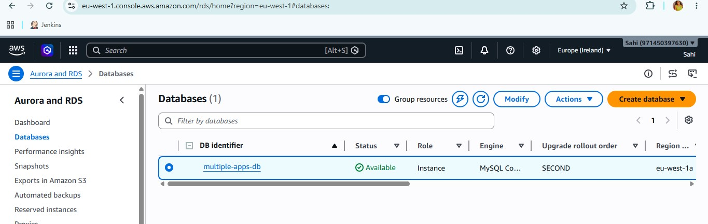
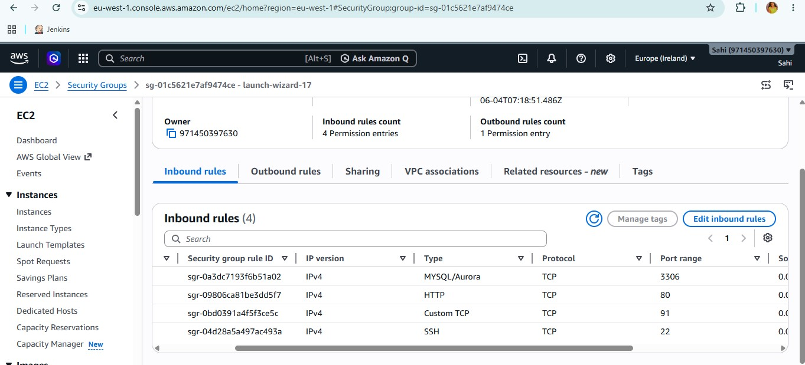
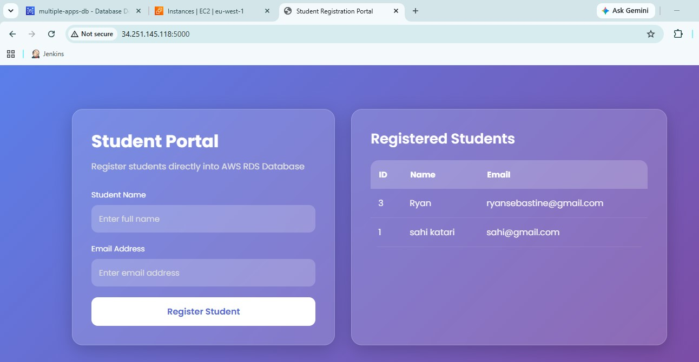
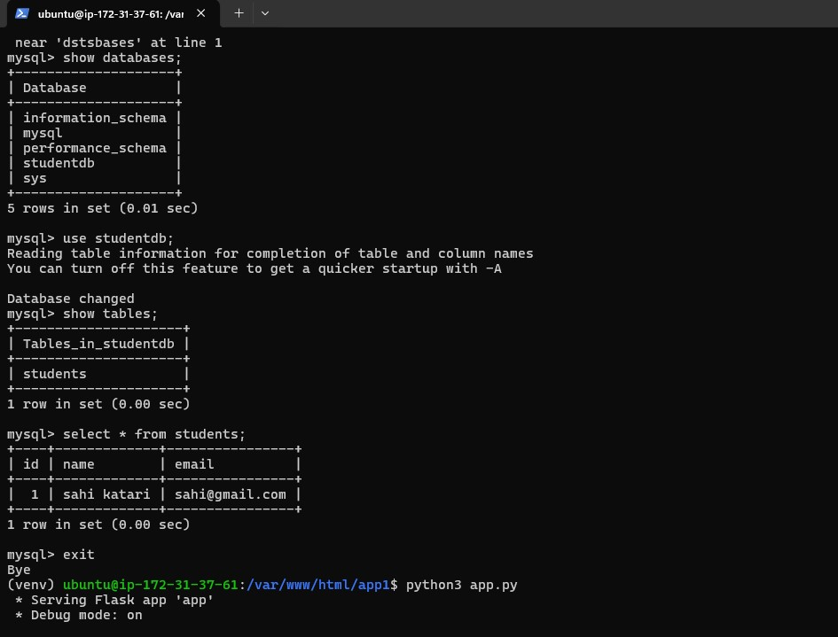
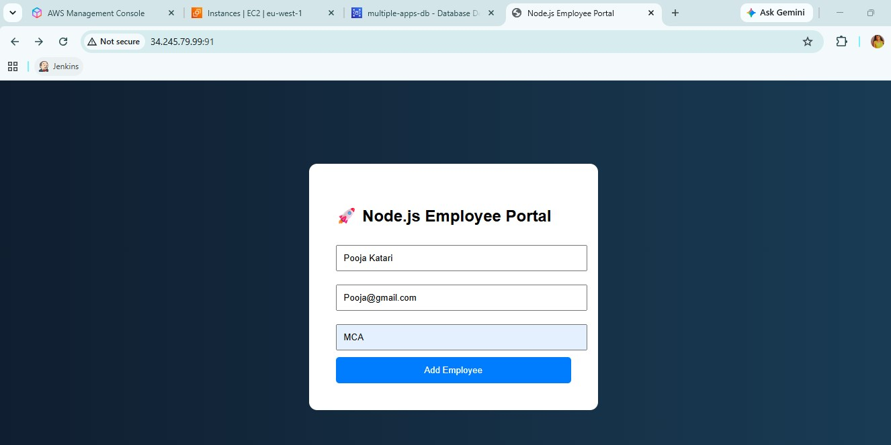
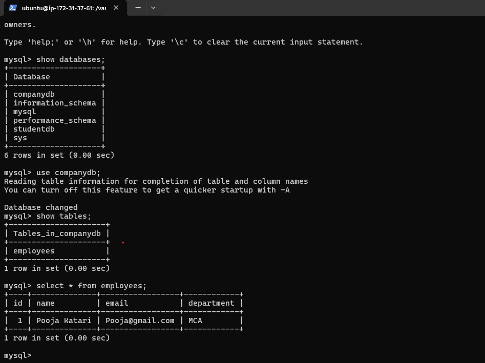
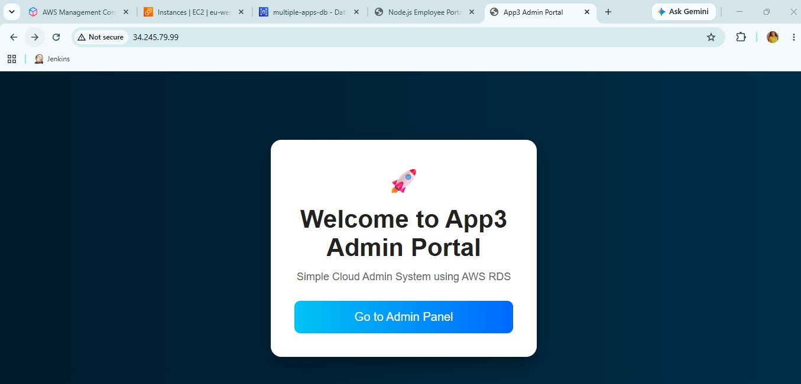
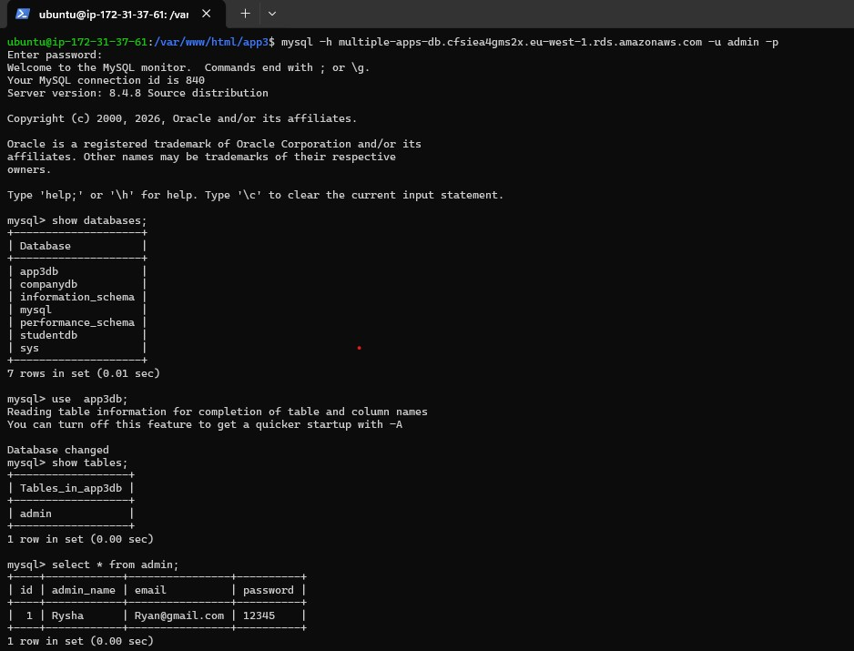

# 🚀 AWS Multi-App Deployment | Flask • Node.js • PHP | Nginx Reverse Proxy | RDS

## 📌 Project Overview

This project demonstrates hosting multiple web applications on a single AWS EC2 instance using Nginx Reverse Proxy and a shared AWS RDS MySQL database.

## 🏗️ Architecture Components

* 🐍 Flask Application (Python)
* 🟢 Node.js Application
* 🌐 PHP/HTML-CSS Application
* 🔄 Nginx Reverse Proxy
* 🗄️ AWS RDS MySQL Database
* ☁️ AWS EC2 Ubuntu Server

## ✨ Features

* 🚀 Multiple applications hosted on one server
* 🔄 Nginx reverse proxy configuration
* 🗄️ Shared AWS RDS backend database
* 🔐 Secure database connectivity
* 📊 Dynamic data insertion and retrieval
* 🌍 Production-style deployment architecture

## 🛠️ Technologies Used

* ☁️ AWS EC2
* 🗄️ AWS RDS
* 🌐 Nginx
* 🐍 Python Flask
* 🟢 Node.js
* 🐘 PHP
* 🐬 MySQL
* 🐧 Ubuntu Linux

---

## 🏗️ Architecture Diagram

```text
                Internet
                    │
                    ▼
              AWS EC2 Server
                    │
               Nginx Reverse Proxy
        ┌───────────┼───────────┐
        │           │           │
        ▼           ▼           ▼
     App1        App2        App3
   Python       Node.js     HTML/PHP
        │           │           │
        └───────────┴───────────┘
                    │
                    ▼
             AWS RDS MySQL
```

---

## 🛠️ Technologies Used

### ☁️ Cloud

* AWS EC2 Ubuntu
* AWS RDS MySQL

### ⚙️ Backend

* Python Flask
* Node.js
* PHP

### 🌐 Web Server

* Nginx

### 🗄️ Database

* MySQL

---

# 📥 Installation Commands

```bash
sudo apt update
sudo apt install nginx php php8.5-fpm mariadb-server -y
sudo apt install mysql-client -y
sudo apt install python3-pip python3-venv -y
```

---

# 📁 Create Application Directories

```bash
sudo mkdir -p /var/www/html/app1 /var/www/html/app2 /var/www/html/app3
```
---

# 🐍 Python Flask Application Setup 

###  Python Application Structure

```bash
app1/
├── app.py
└── templates/
    └── index.html
```

###  Navigate to Application Directory
```bash
cd /var/www/html/app1
python3 -m venv venv
source venv/bin/activate
pip install flask pymysql gunicorn
sudo nano app.py
sudo mkdir templates
cd templates/
sudo nano index.html
cd ..
```
---

##  Change Ownership

```bash
sudo chown -R ubuntu:ubuntu /var/www/html/app1
```
---

###  AWS RDS Connection Test

```bash
mysql -h rds-name -u admin -p
```
---
### Nginx Reverse Proxy Configuration

```nginx id="q7j1zy"
 Refer to config-app1 file.
```
---

### Restart Nginx

```bash id="5x1b1k"
sudo nginx -t

sudo systemctl restart nginx
```
---

### 🌍 Access Application

```text
http://<SERVER_IP>:90
```

# 🟢 Node.js Application Setup

###  Node.js Application Structure

```bash
/var/www/html/app2
│
├── app.js
└── views
    └── index.ejs
```

###  Navigate to Application Directory

```bash
cd /var/www/html/app2
sudo nano app.py
sudo mkdir templates
cd templates
sudo nano index.ejs
cd ..
```

###  Install Node.js and npm

```bash
sudo apt update
sudo apt install nodejs npm -y
```

###  Verify Installation

```bash
node -v
npm -v
```

###  Initialize Node.js Project

```bash
npm init -y
```

###  Install Required Packages

```bash
npm install express mysql2
```
###  Configure AWS RDS Connection
```bash
mysql -h rds-name -u admin -p
```

### Nginx Reverse Proxy Configuration

```nginx id="q7j1zy"
 Refer to config-app2 file.
```

### Restart Nginx

```bash id="5x1b1k"
sudo nginx -t

sudo systemctl restart nginx
```

###  Start Application

```bash
node app.js
```

###  Run Application in Background

Install PM2:

```bash
sudo npm install -g pm2
```

Start application:

```bash
pm2 start app.js 
```

Check status:

```bash
pm2 list
```
---

### 🌍 Access Application

```text
http://<SERVER_IP>:91
```

## 🌐 PHP / HTML-CSS Application Structure

### 📂 Project Structure

```text
app3/
├── index.php
└── admin.php
```

### 🛠️ Create Project Structure

```bash
cd /var/www/html/app3
sudo nano index.php
sudo nano admin.php
```
###  Configure AWS RDS Connection
```bash
mysql -h rds-name -u admin -p
```

### Nginx Reverse Proxy Configuration

```nginx id="q7j1zy"
 Refer to config-app3 file.
```

### Restart Nginx

```bash id="5x1b1k"
sudo nginx -t

sudo systemctl restart nginx
```
### 🌍 Access Application

```text
http://<SERVER_IP>
```
### 🎯 Skills Gained

* ☁️ AWS EC2 & RDS Configuration
* 🌐 Nginx Reverse Proxy Setup
* 🐍 Flask Application Deployment
* 🟢 Node.js Application Deployment
* 🐘 PHP & MySQL Integration
* 🗄️ Database Connectivity with AWS RDS
* 🐧 Linux Server Administration
* 🔐 Security Group & Network Configuration
* 🚀 Multi-App Hosting on a Single Server
* 📦 Process Management with PM2
* 🔧 Git & GitHub Version Control
* 🏗️ Cloud Architecture Design
* 🛠️ Troubleshooting & Deployment Automation

  # 📸 Application Screenshots

## 🌐 RDS Creation



---
## 🔐 AWS Security Group



---

## 🗄️ APP1



---


## 🗄️App1-Database-Output



---

## 🗄️ APP2



---


## 🗄️App1-Database-Output



---

## 🗄️ APP3



---


## 🗄️App1-Database-Output



---


